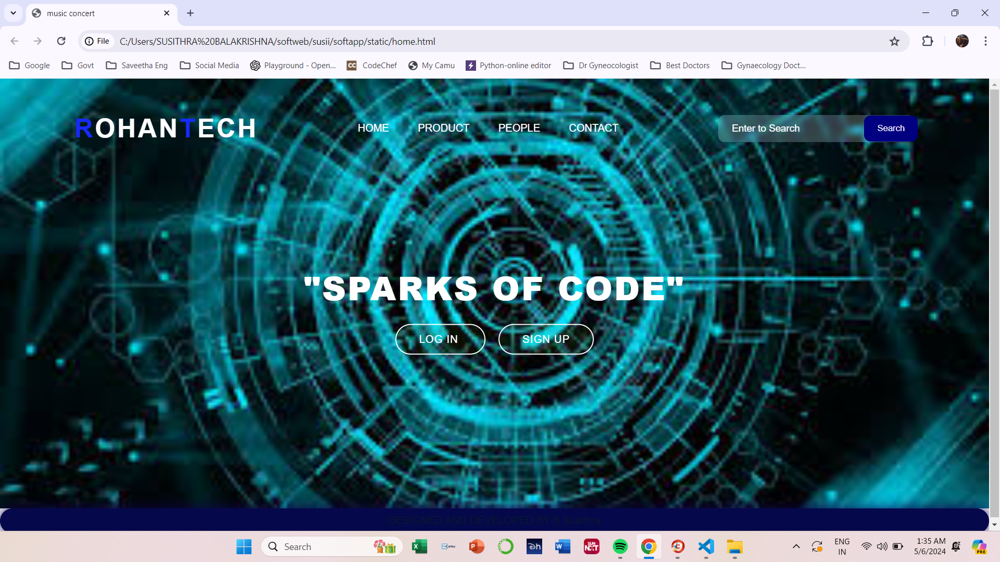
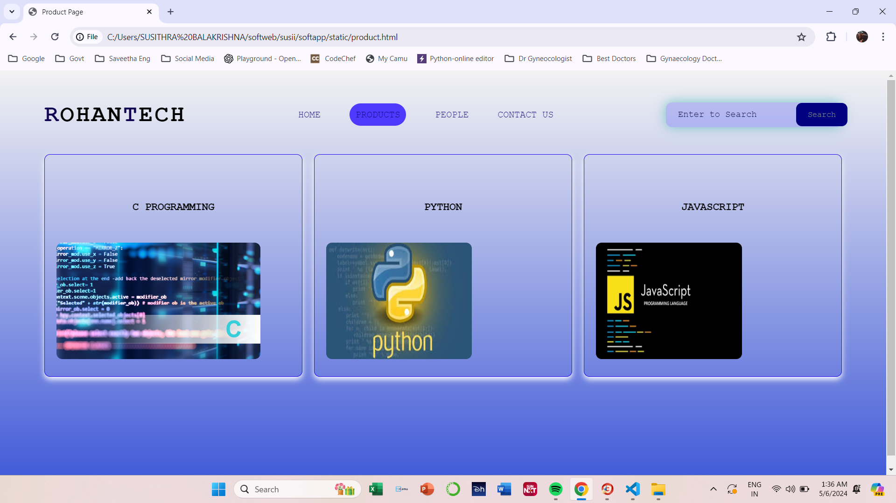

# Ex.07 Software Product Company Website
## Date:06.05.2024

## AIM:
To develop a static company website to display the softwares and services provided by the company.

## DESIGN STEPS:

### Step 1:
Requirement collection.

### Step 2:
Creating the layout using HTML and CSS.

### Step 3:
Updating the sample content.

### Step 4:
Choose the appropriate style and color scheme.

### Step 5:
Validate the layout in various browsers.

### Step 6:
Validate the HTML code.

### Step 7:
Publish the website in the given URL.

## PROGRAM:
```
home.html

<html>
  <head>
    <meta name="viewport" content="width=device-width, initial-scale=1.0" />
    <title>music concert</title>
    <style type="text/css">
      * {
        margin: 0;
        padding: 0;
        font-family: Arial, Helvetica, sans-serif;
      }
      .banner {
        width: 100%;
        height: 95vh;
        background-image:url(web\ img\ 1.jpeg);
        background-size: cover;
        background-position: center;
      }
      .navbar {
        width: 85%;
        margin: auto;
        padding: 35px 0;
        display: flex;
        align-items: center;
        justify-content: space-between;
      }
      .logo {
        color: #172bff;
        font-size: 40px;
        font-weight: 700;
        letter-spacing: 3px;
      }
      span {
        color: white;
      }
      form {
        width: 300px;
        height: 40px;
        display: flex;
        background: rgba(255, 255, 255, 0.2);
        padding: 1px 1px;
        font-size: 15px;
        border-radius: 10px;
        backdrop-filter: blur(4px) saturate(180%);
      }
      form input {
        background: transparent;
        flex: 1;
        border: 0;
        outline: none;
        padding: 12px 20px;
        font-size: 15px;
        color: white;
      }
      ::placeholder {
        color: white;
      }
      form button {
        border: 0;
        outline: none;
        padding: 5px 20px;
        color: white;
        border-radius: 10px;
        background:navy;
        cursor: pointer;
      }
      #search.hover {
        border: 1px;
        padding: 10px;

        transition: 0.5s;
        cursor: pointer;
        border-radius: 30px;
        background: rgb(0, 26, 255);
        color: #081b29;
        box-shadow: 0 0 20px rgb(114, 194, 200);
      }
      .navbar li {
        list-style: none;
        display: inline-block;
        margin: 0 20px;
        position: relative;
      }
      .navbar li a {
        text-decoration: none;
        color: white;
        text-transform: uppercase;
      }
      .navbar li:hover {
        border: 1px;
        padding: 10px;

        transition: 0.5s;
        cursor: pointer;
        border-radius: 30px;
        background: rgb(7, 27, 115);
        color: #081b29;
        box-shadow: 0 0 20px rgb(238, 240, 240);
      }
      .content {
        position: absolute;
        top: 50%;
        left: 50%;
        transform: translate(-50%, -50%);
        text-align: center;
      }
      .text h2 {
        color: white;
        font-weight: 800;
        font-size: 50px;
        letter-spacing: 3px;
      }
      .text p {
        color: white;
        text-transform: capitalize;
        font-size: 15px;
        margin-bottom: 30px;
        word-spacing: 2px;
        letter-spacing: 1px;
      }
      .login {
        margin: 0px 10px;
        border: 2px solid #ffffff;
        padding: 13px 35px;
        letter-spacing: 1px;
        color: white;
        border-radius: 30px;
        background-color:#3a5c121f;
        text-decoration: none;
      }
      .login:hover {
        border: 2px solid #00d5ff;
        color: #0d0065;
        background-color: white;
        transition: 0.5s;
        cursor: pointer;
      }
      .signup {
        margin: 0px 10px;
        border: 2px solid white;
        padding: 13px 35px;
        letter-spacing: 1px;
        color: white;
        border-radius: 30px;
        background-color:#3a5c121f;
        text-decoration: none;
      }
      .signup:hover {
        border: 2px solid #068bce;
        color: #0d0065;
        background-color: white;
        transition: 0.5s;
        cursor: pointer;
      }
      footer {
        border: 1px;
        padding: 10px;

        transition: 0.5s;
        cursor: pointer;
        border-radius: 30px;
        background: rgb(5, 8, 74);
        color: #081b29;
        box-shadow: 0 0 20px rgb(16, 3, 80);
      }
    </style>
  </head>
  <body>
    <div class="banner">
      <br />
      <div class="navbar">
        <h1 class="logo">R<span>OHAN</span>T<span>ECH</span></h1>
        <ul>
          <li><a href="home.html"> HOME </a></li>
          <li><a href="product.html">PRODUCT</a></li>
          <li><a href="people.html"> PEOPLE </a></li>
          <li><a href="contact.html"> CONTACT </a></li>
        </ul>
        <form action="" method="get">
          <input type="text" placeholder="Enter to Search" />
          <button id="search" type="submit">Search</button>
        </form>
      </div>
      <div class="content">
        <div class="text">
          <h2>
            "SPARKS OF CODE"
          </h2>
          <br />
          <br />
          <div>
            <a href="#" class="lOGIN"> LOG IN </a>
            <a href="#" class="SIGNUP"> SIGN UP </a>
          </div>
        </div>
      </div>
    </div>
    <footer>
      <center>DESIGNED AND DEVELOPED BY B Susithra<center>
    </footer>
 </body>
</html>

product.html

<html>
    <head>
        <meta name="viewport" content="width=device-width, initial-scale=1.0">
        <title> Product Page </title>
        <style type="text/css">
            * {
                margin: 0;
                padding: 0;
                font-family: 'Courier New', Courier, monospace;
            }
            .banner {
                width: 100%;
                height: 100vh;
                background-image: linear-gradient(rgba(239, 239, 239, 0.75),rgba(4, 37, 203, 0.75));
                background-size: cover;
                background-position: center;
            }
            .navbar {
                width: 90%;
                margin: auto;
                padding: 35px 0;
                display: flex;
                align-items: center;
                justify-content: space-between;
            }
            .bg-product {
                border: 1px;
                padding: 10px;
                color: gray;
                background-color:#4e3aff;
                border-radius: 30px;
            }
            .logo {
                color:#120452;
                font-size: 40px;
                font-weight: 700;
                letter-spacing: 3px;
            }
            span {
                color: rgb(0, 0, 0);
            }
            form {
                width: 300px;
                height: 40px;
                display: flex;
                background: rgba(11, 14, 198, 0.2);
                padding: 1px 1px;
                font-size: 15px;
                border-radius: 10px;
                backdrop-filter: blur(4px) saturate(180%);
                box-shadow: 0 0 20px rgb(114, 194, 200);
            }
            form input {
                background: transparent;
                flex: 1;
                border: 0;
                outline: none;
                padding: 12px 20px;
                font-size: 15px;
                color:black;
            } 
            ::placeholder {
                color: rgb(7, 9, 69);
            }
            form button {
                border: 0;
                outline: none;
                padding: 5px 20px;
                color: gray;
                border-radius: 10px;
                background:navy;
                cursor: pointer;
            }
            .navbar li {
                list-style: none;
                display: inline-block;
                margin: 0 20px;
                position: relative;
            }
            .navbar li a {
                text-decoration: none;
                color: rgb(11, 6, 117);
                text-transform: uppercase;
            }
            .navbar li:hover {
                border: 1px;
                padding: 10px;
                color: rgb(11, 6, 117);
                background-color:#2b006b;
                transition: 0.5s; 
                cursor: pointer;
                border-radius: 30px;
            }
            .container {
                background: transparent;
                padding: 10px 5%;
                padding-bottom: 100px;
            }
            .container .box-container {
                display: grid;
                grid-template-columns: repeat(auto-fit, minmax(170px, 1fr));
                gap: 20px;
            }
            .container .box-container .box {
                color: rgb(255, 255, 255);
                box-shadow: 0 5px 10px white;
                border-radius: 10px;
                background: transparent;
                border: 1px solid rgb(30, 7, 243);
                padding: 30px 20px;
            }
            .container .box-container .box img {
                height: 200px;
                border-radius: 10px;
            }
            .container .box-container .box h3 {
                color:#030303;
                font-size: large;
                padding: 50px 10;
            }
            .container .box-container .box p {
                color: rgb(0, 0, 0);
                font-size: small;
                line-height: 1.5;
            }
            footer {
                background-color:#06b7e3;
                margin-top: auto;
            }
        </style>
    </head>
<body>
    <div class="banner">
        <br>
        <div class="navbar">
          <h1 class="logo">R<span>OHAN</span>T<span>ECH</span></h1>
            <ul>
                <li><a href="http://127.0.0.1:8000/static/homepage.html"> Home </a></li>
                <li><a href="http://127.0.0.1:8000/static/products.html" class="bg-product"> Products </a></li>
                <li><a href="http://127.0.0.1:8000/static/people.html"> People </a></li>
                <li><a href="http://127.0.0.1:8000/static/contact.html"> Contact us</a></li>
            </ul>
            <form action="" method="get">
                <input type="text" placeholder="Enter to Search">
                <button type="submit"> Search </button>
            </form>
        </div>
        <div class="container">
            <div class="box-container">
              
                
                <div class="box">
                    <h3 align="center">C PROGRAMMING</h3>
                    <image src="WEB IMG C.png" width="350" height="600"></image>
                </div>
                <div class="box">
                    <h3 align="center"> PYTHON </h3>
                    <image src="WEB PYTHON IMG.jpeg" width="250" height="300"></image>
                </div>
                <div class="box">
                    <h3 align="center">JAVASCRIPT</h3>
                    <image src="web img java.png" width="250" height="300"></image>
                </div>
            </div>
              
            </div>
        </div>
    </div>
    <footer>
        <center>Designed and Developed by SUSITHRA B (212223220113)</center>
    </footer>
</body>
</html>

people.html

<html>
  <head>
    <meta name="viewport" content="width=device-width, initial-scale=1.0" />
    <title>people page</title>
    <style type="text/css">
      * {
        margin: 0;
        padding: 0;
        font-family: Arial, Helvetica, sans-serif;
      }
      .banner {
        width: 100%;
        height: 95vh;
        background-image:url(web\ img\ 1.jpeg);
        background-size: cover;
        background-position: center;
      }
      .navbar {
        width: 85%;
        margin: auto;
        padding: 35px 0;
        display: flex;
        align-items: center;
        justify-content: space-between;
      }
      .bg-people {
        border: 1px;
        padding: 10px;
        color: white;
        background-color: #150195;
        border-radius: 30px;
      }
      .logo {
        color:navy;
        font-size: 40px;
        font-weight: 700;
        letter-spacing: 3px;
      }
      span {
        color: white;
      }
      form {
        width: 300px;
        height: 40px;
        display: flex;
        background:white;
        padding: 1px 1px;
        font-size: 15px;
        border-radius: 10px;
        backdrop-filter: blur(4px) saturate(180%);
      }
      form input {
        background: transparent;
        flex: 1;
        border: 0;
        outline: none;
        padding: 12px 20px;
        font-size: 15px;
        color: white;
      }
      ::placeholder {
        color: white;
      }
      form button {
        border: 0;
        outline: none;
        padding: 5px 20px;
        color: white;
        border-radius: 10px;
        background: blue;
        cursor: pointer;
      }
      .navbar li {
        list-style: none;
        display: inline-block;
        margin: 0 20px;
        position: relative;
      }
      .navbar li a {
        text-decoration: none;
        color: white;
        text-transform: uppercase;
      }
      .navbar li:hover {
        border: 1px;
        padding: 10px;

        transition: 0.5s;
        cursor: pointer;
        border-radius: 30px;
        background:blue;
        color: #081b29;
        box-shadow: 0 0 20px rgb(139, 236, 255);
      }
      .image {
        position: relative;
        border: 0;
        top: 150px;

        background: transparent;
      }
      .image table {
        border: 0;
        color: white;
        position: relative;
        left: 200px;
      }
      .image table img {
        height: 140px;
        width: 140px;
        border: 2px solid white;
        padding: 5px;
        border-radius: 50%;
      }
      .image table td {
        color: #f6f6ff;
      }
      footer {
        border: 1px;
        padding: 10px;

        transition: 0.5s;
        cursor: pointer;
        border-radius: 30px;
        background:white;
        color: #081b29;
        box-shadow: 0 0 20px rgb(14, 239, 255);
      }
    </style>
  </head>
  <body>
    <div class="banner">
      <br />
      <div class="navbar">
        <h1 class="logo">R<span>OHAN</span>T<span>ECH</span></h1>
        <ul>
          <li><a href="home.html"> Home </a></li>
          <li><a href="product.html"> Products </a></li>
          <li><a href="people.html" class="bg-people"> People </a></li>
          <li><a href="contact.html"> Contact </a></li>
        </ul>
        <form action="" method="get">
          <input type="text" placeholder="Enter to Search" />
          <button type="submit">Search</button>
        </form>
      </div>
      <div class="image">
        <table cellspacing="20">
          <tr align="center">
            <td></td>
            <td></td>
            <td></td>
            <td></td>
          </tr>
          <tr align="center">
            <th>Susithra B</th>
            <th>SUNDAR PICHAI</th>
            <th>ELON MUSK</th>
            <th>MUKESH AMBANI</th>
          </tr>
          <tr align="center">
            <td>CEO</td>
            <td>CEO,Co-Founder</td>
            <td>CTO,Co-Founder</td>
            <td>DIRECTOR</td>
          </tr>
        </table>
      </div>
    </div>
    <footer>
      <center>Designed and Developed by SUSITHRA.B(212223220113)</center>
    </footer>
</body>
</html>

contact.html

contact.html
<html>
  <head>
    <meta name="viewport" content="width=device-width, initial-scale=1.0" />
    <title>Contact Us Page</title>
    <style type="text/css">
      * {
        margin: 0;
        padding: 0;
        font-family: Arial, Helvetica, sans-serif;
      }
      .banner {
        width: 100%;
        height: 95vh;
        background-image:url(web\ img\ 1.jpeg);
        background-size: cover;
        background-position: center;
      }
      .navbar {
        width: 85%;
        margin: auto;
        padding: 35px 0;
        display: flex;
        align-items: center;
        justify-content: space-between;
      }
      .bg-contact {
        border: 1px;
        padding: 10px;
        color: white;
        background-color: #00d5ff;
        border-radius: 30px;
      }
      .logo {
        color:navy;
        font-size: 40px;
        font-weight: 700;
        letter-spacing: 3px;
      }
      span {
        color: white;
      }
      .navbar form {
        width: 300px;
        height: 40px;
        display: flex;
        background:black;
        padding: 1px 1px;
        font-size: 15px;
        border-radius: 10px;
        backdrop-filter: blur(4px) saturate(180%);
      }
      .navbar form input {
        background: transparent;
        flex: 1;
        border: 0;
        outline: none;
        padding: 12px 20px;
        font-size: 15px;
        color: white;
      }
      ::placeholder {
        color: white;
      }
      .navbar form button {
        border: 0;
        outline: none;
        padding: 5px 20px;
        color: white;
        border-radius: 10px;
        background: #00d5ff;
        cursor: pointer;
      }
      .navbar li {
        list-style: none;
        display: inline-block;
        margin: 0 20px;
        position: relative;
      }
      .navbar li a {
        text-decoration: none;
        color: white;
        text-transform: uppercase;
      }
      .navbar li:hover {
        border: 1px;
        padding: 10px;

        transition: 0.5s;
        cursor: pointer;
        border-radius: 30px;
        background: #0ef;
        color: #081b29;
        box-shadow: 0 0 20px #0ef;
      }
      .box {
        display: flex;
        column-gap: 40px;
        background: transparent;
        position: relative;
        top: 50px;
      }
      .box-1 {
        height: 400px;
        width: 400px;
        border: 3px solid white;
        border-radius: 20px;
        background: transparent;
        position: relative;
        left: 250px;
      }
      .box-2 {
        height: 400px;
        width: 400px;
        border: 3px solid skyblue;
        border-radius: 20px;
        background: transparent;
        position: relative;
        left: 300px;
      }
      .box-1 form {
        display: flex;
        color: white;
        background: transparent;
        padding: 10px;
        font-size: 15px;
        position: relative;
        top: 15px;
      }
      .box-1 form input {
        background: transparent;
        display: flex;
        border: 1px solid white;
        border-radius: 10px;
        padding: 15px 30px;
        font-size: 15px;
        color: white;
        position: relative;
        top: 30px;
      }
      .box-1 form textarea {
        background: transparent;
        color: white;
        padding: 15px 10px;
        position: relative;
        top: 30px;
        left: 20px;
        border: 1px solid white;
        border-radius: 10px;
        width: 300px;
      }
      .box-1 form button {
        border: 0;
        outline: none;
        padding: 10px 20px;
        color: white;
        border-radius: 30px;
        background: blue;
        cursor: pointer;
        position: relative;
        top: 50px;
      }
      .box-2 h2 {
        color: white;
        position: relative;
        top: 25px;
        left: 50px;
        font-size: 30px;
      }
      .box-2 p {
        color: white;
        position: relative;
        top: 50px;
        padding: 10px 80px;
      }
      .box-2 span {
        color: blue;
        font-size: 20px;
      }
      footer {
        border: 1px;
        padding: 10px;

        transition: 0.5s;
        cursor: pointer;
        border-radius: 30px;
        background: #0ef;
        color:rgb(250, 250, 255);
        box-shadow: 0 0 20px #0ef;
      }
    </style>
  </head>
  <body>
    <div class="banner">
      <br />
      <div class="navbar">
        <h1 class="logo">R<span>OHAN</span>T<span>ECH</span></h1>
        <ul>
          <li><a href="home.html"> Home </a></li>
          <li><a href="product.html"> Products </a></li>
          <li><a href="people.html"> People </a></li>
          <li><a href="contact.html" class="bg-contact"> Contact </a></li>
        </ul>
        <form action="" method="get">
          <input type="text" placeholder="Enter to Search" />
          <button type="submit">Search</button>
        </form>
      </div>
      <div class="box">
        <div class="box-1">
          <form>
            <center>
              <h1>Contact Us</h1>
              <input type="text" placeholder="Your Name" />
              <br />
              <input type="email" placeholder="Your Email" />
              <br />
              <textarea rows="4" cols="40" placeholder="Your Message">
              </textarea>
              <br />
              <button type="submit">Submit</button>
            </center>
          </form>
        </div>
        <div class="box-2">
          <h2>CONTACT INFORMATION</h2>
          <p>
            <span>Address</span> :No.5,main road,vadivel nagar,
            sankaranpalayam,vellore
          </p>
          <p><span>Email</span> : susithra278@gmail.com</p>
          <p><span>Phone</span> : 9345634532</p>
        </div>
      </div>
    </div>
    <footer>
      <center>Designed and Developed by SUSITHRA B(212223220113)</center>
    </footer>
  </body>
</html>
```

## OUTPUT:
<<<<<<< HEAD




## RESULT:
The program for designing software company website using HTML and CSS is completed successfully.
